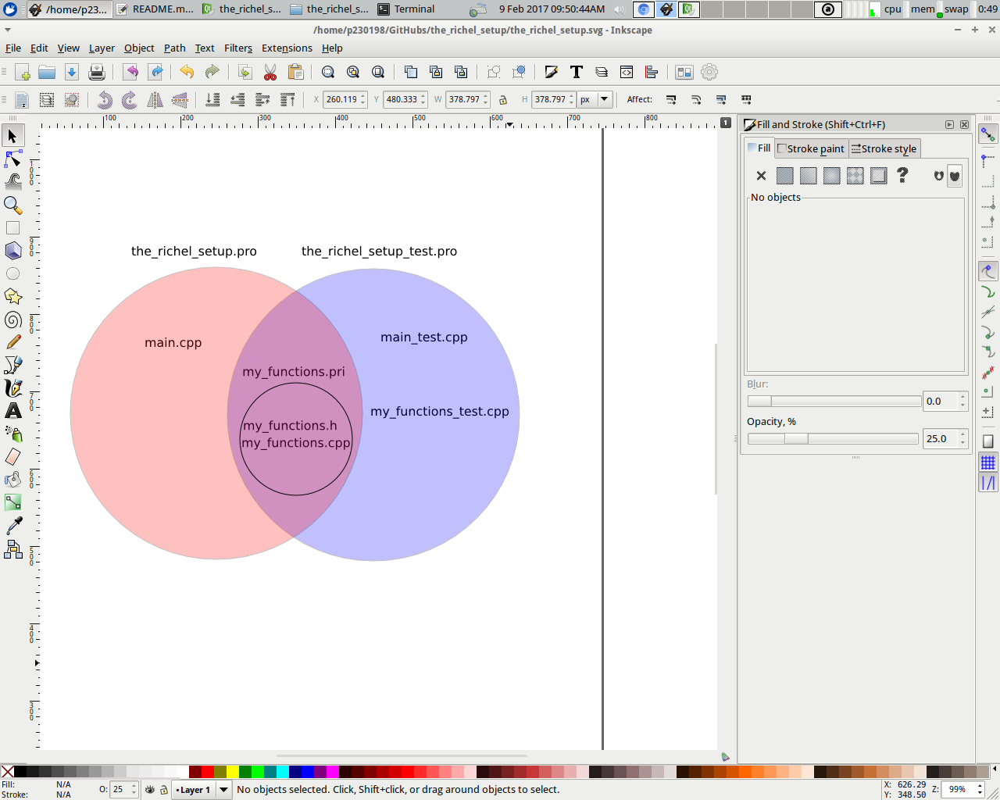
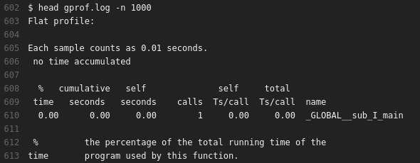
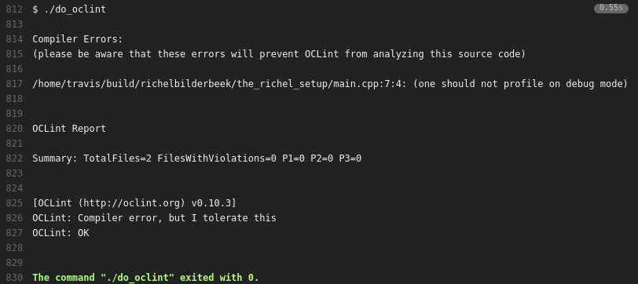
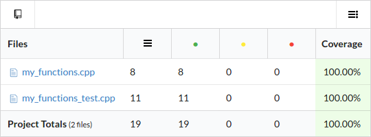
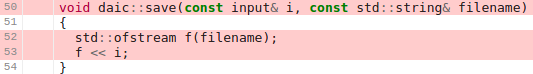

# the_richel_setup

Branch|[](https://travis-ci.org)|[](https://www.codecov.io)
---|---|---
master|[](https://travis-ci.org/richelbilderbeek/the_richel_setup)|[](https://codecov.io/github/richelbilderbeek/the_richel_setup/branch/master)

`the_richel_setup` shows Richel Bilderbeek's favorite C++ setup.

## Table of Content

 * Goals
 * Name of the setup
 * Prerequisites
 * Bird's eye view
   * The normal run
     * `main.cpp`
     * `the_richel_setup.pro`
   * The testing run
     * `main_test.cpp`
     * `the_richel_setup_test.pro`
     * `my_functions_test.cpp`
   * The `my_functions` unit
     * `the_richel_setup.pri`
     * `my_functions.h`
     * `my_functions.cpp`
 * Diagnostics
   * Boost.Test
   * Profile
   * OCLint
   * Codecov
 * Use it for your own work
 * Where do I put additions?
   * I want to add a new function
   * I want to add a new unit
 * Extensions
 * Conclusion
 * Notes

## Goals

`the_richel_setup` has:

 * clean seperation of test and normal execution
 * test build has a high amount of runtime testing
 * the normal build can be used for profiling
 * code coverage is measured
 * style is checked by OCLint

## Name of the setup

I think 'the Richel setup' is a bad name. I prefer not to name things after myself.
On the other hand, it *is* my personal setup. But the major reason for chosing
this name, is that I lacked a better one. 

Names I considered are:

 * The dual-XOR setup, as `main`s must be exclusive to each project
 * The FOE setup ('Figure Of Eigth'), after the figure of eight in the picture
 * The infinity setup, after the figure of eight in the picture

If you know a better one, please let me know, by posting an Issue.

## Prerequisites

To get this setup to work, you'll need to have:

 * A Travis CI account at www.travis.org and sign in. This can be done with your GitHub
 * A Codecov account at www.codecov.io and sign in. This can be done with your GitHub

## Bird's eye view

The files are distributed over two projects as such:



This picture shows which files are part of which project.
The files used by the normal run are in red, at the left.
The files used by the testing run are in blue at the right.
The files used by both setups are in the overlapping section.
The most important file used by both setups is called `my_functions.pri`,
which includes the `my_functions` unit (that is: `my_functions.h` and `my_functions.cpp`)
to the project.

The goal of this setup is to both test and profile the functions in `the_richel_project.pri` project
include file.

The normal setup has one project file, `the_richel_setup.pro`. The `main` function of this project is in the file `main.cpp` (I prefer being unoriginal with naming).
The functions to be *used* are in the `the_richel_setup.pri` project include file. 
Even though the tests may fail, one can still use those functions. 
And it is this `main` function that is being profiled by `gprof`.

The testing setup has one project file, `the_richel_setup_test.pro`. The `main` function of this project is in 
the file `main_test.cpp`. The functions to be *tested* are in the `the_richel_setup.pri` project include file. 
The tests for the functions are in `my_functions_test.cpp`. 
Boost.Test is used as a testing harness. If a test fails, other tests are still performed, 
even if `std::abort` is called (by, for example, `assert`).

### The normal run

The normal run *uses* the functions in the `the_richel_setup.pri` project include file.
Because the tests are absent in this project, it can still be run when tests fail.
The normal run is suited for profiling. Profiling only gives sensible results in release mode,
which is tested for in the `main` function.

##### `main.cpp`

The `main` function just demonstrates some use of the functions in the `my_function` unit:

```
#include "my_functions.h"
#include <iostream>

int main()
{
  #ifndef NDEBUG
  #error(one should not profile in debug mode)
  #endif

  std::cout << is_odd(42) << '\n';
  std::cout << calc_mean( { 41.0, 42.0, 43.0 } ) << '\n';
}
```

`main.cpp` is part of `the_richel_setup.pro`, which encompasses the normal run. This file:

 * `#include`s some header files
 * tests that `NDEBUG` is `#defined`. `NDEBUG` will be `#defined` in release mode only. Being
   in release mode is a prerequisite for profiling.  
 * demonstrates the functions `is_odd` and `calc_mean`. These are the functions we are interested in

The demonstration of the functions of interested is very short. This is because of clarity only. In the
end, this is the spot where to start your numerical calculations.

#### `the_richel_setup.pro`

The `the_richel_setup.pro` files defines which files belong to
the normal run project and how this should be compiled.

```
# Files
include(the_richel_setup.pri)
SOURCES += main.cpp

# C++14
CONFIG += c++14
QMAKE_CXX = g++-5
QMAKE_LINK = g++-5
QMAKE_CC = gcc-5
QMAKE_CXXFLAGS += -std=c++14

# High warnings levels
QMAKE_CXXFLAGS += -Wall -Wextra -Wshadow -Wnon-virtual-dtor -pedantic -Weffc++ -Werror

# Allow debug and release mode
CONFIG += debug_and_release

# In release mode, turn on profiling
CONFIG(release, debug|release) {

  DEFINES += NDEBUG

  # gprof
  QMAKE_CXXFLAGS += -pg
  QMAKE_LFLAGS += -pg
}
```

This project consists out of three files: `main.cpp` and the `my_functions` unit. 
Tests are absent in this build entirely. 

C++14 is set to be the C++ standard used. The `QMAKE_[something] = [something]-5` are cumbersome, as one would prefer using just the defaults.
This will hinder, for example, crosscompiling by MXE. On the other hand, this setup works on all computers *I* work with, including Travis CI.
If the `-5`s need to be removed to compile, I suggest to just do it. Or create a modified copy.

The warning levels are set to as high as possible: all GCC compiler warnings are enabled. And a warning cannot be ignored,
as `-Werror` escalates a warning as an error.

Then debug and release modes are both enabled. This may be unexpected: the `main` function will not compile in debug mode.
And that is exactly where is relied upon [NOTE 1]. 


In release mode, the `NDEBUG` flag is defined. This will compile the project in release mode. Among others,
all `assert`s are removed from your code by the preprocessor. 

Additionally, in release mode, the flags for profiling are enabled.

## The test run

The test run *tests* the functions in the `my_functions` unit.
In testing, all diagnostics can be enabled

### `main_test.cpp`

Using Boost.Test has many advantages. One
is that you do not need to write a `main` 
function by hand: 

```
#define BOOST_TEST_DYN_LINK
#define BOOST_TEST_MODULE my_functions_test_module
#include <boost/test/unit_test.hpp>

#ifdef NDEBUG
#error(one should not test in release mode)
#endif
```

That is great: one does not need to worry to include all tests. Boost.Test will detect
all test cases itself and run these.

Next to this, there is a `#ifdef` that checks if the tests
are run in debug mode. There is no reason to run tests
in release mode.

### `the_richel_setup_test.pro`

The `the_richel_setup_test.pro` files defines which files belong to
the test run project and how this should be compiled.

```
# Files
include(the_richel_setup.pri)
SOURCES += main_test.cpp my_functions_test.cpp

# C++14
CONFIG += c++14
QMAKE_CXX = g++-5
QMAKE_LINK = g++-5
QMAKE_CC = gcc-5
QMAKE_CXXFLAGS += -std=c++14

# High warnings levels
QMAKE_CXXFLAGS += -Wall -Wextra -Wshadow -Wnon-virtual-dtor -pedantic -Weffc++ -Werror

# Allow debug and release mode
CONFIG += debug_and_release

# In debug mode, turn on gcov and UBSAN
CONFIG(debug, debug|release) {

  # gcov
  QMAKE_CXXFLAGS += -fprofile-arcs -ftest-coverage
  LIBS += -lgcov

  # UBSAN
  QMAKE_CXXFLAGS += -fsanitize=undefined
  QMAKE_LFLAGS += -fsanitize=undefined
  LIBS += -lubsan
}

# Boost.Test
LIBS += -lboost_unit_test_framework
```

Next to the `my_functions` unit and the testing main, 
there is a `my_functions_test.cpp` file.
This file contains all -how unexpected- tests.

C++14 is used at the highest warnings level. Warnings are escalated to errors.

Also this file allows for a debug and release mode, but
the `main_test.cpp` file will check that the project
will be compiled in debug mode.

The debug mode enables `gcov` and `UBSAN`. `gcov` allows for measuring code coverage,
where `UBSAN` ('Undefined Behavior SANitizer') checks for undefined behavior. Testing
will be slower due to this, be more thorough.

Lastly, there is a linking to the Boost.Test library.

### `my_functions_test.cpp`

This is the file in which the functions are tested:

```
#include <boost/test/unit_test.hpp>

#include "my_functions.h"

BOOST_AUTO_TEST_CASE(test_is_odd)
{
  BOOST_CHECK(!is_odd(0));
  BOOST_CHECK( is_odd(1));
}

BOOST_AUTO_TEST_CASE(test_calc_mean)
{
  const double measured{
    calc_mean( {1.0, 2.0, 3.0} )
  };
  const double expected{2.0};
  BOOST_CHECK_EQUAL(measured, expected);
}

BOOST_AUTO_TEST_CASE(test_calc_mean_needs_nonempty_vector)
{
  std::vector<double> empty;
  BOOST_CHECK_THROW(
    calc_mean(empty), 
    std::invalid_argument
  );
}
```

There are three test cases, that can be recognized by `BOOST_AUTO_TEST_CASE` and their label. These labels
are checked to be unique and should inform about the test.

The first test case checks if `is_odd` returns false for a zero, and true for a one.

The second test case checks if the mean of one, two and three is indeed two, as should be
the result of the `calc_mean` function.

The third test case checks if `calc_mean` throws an exception if it is given an empty vector.
One cannot calculate the mean of zero values.

### The `my_functions` unit

The `my_functions` unit consists out of a header file
called `my_functions.h` and an implementation file
called `my_functions.cpp`.

The functions therein are tested by the testing project and
used by the normal run.

#### `the_richel_setup.pri`

The `the_richel_setup.pri` project include file 
contains the filenames of the `my_functions`
unit.

```
SOURCES += my_functions.cpp
HEADERS += my_functions.h
```

This file is where it is determined which files
are in both the normal and testing project.

Would one like to add another, say, `my_helper`, these
can be added here. This would then look like:

```
SOURCES += my_functions.cpp my_helper.cpp
HEADERS += my_functions.h   my_helper.h
```

#### `my_functions.h`

```
#ifndef MY_FUNCTIONS_H
#define MY_FUNCTIONS_H

#include <vector>

///Calculate the mean.
///Will throw if the input is empty
double calc_mean(const std::vector<double>& v);

///Determine if a number is odd
bool is_odd(const int i) noexcept;

#endif // MY_FUNCTIONS_H
```

This header file starts, as is common, with an #include guard.

The header file `vector` in #included and two functions are declared.

The function `is_odd` is `noexcept`, which is a C++11 (and beyond) 
syntax to designate that the function cannot, or will not, throw an exception.

Both functions are documented. Three slashes are used, so that a
document generation like Doxygen will interpret these comments
as documentation.

#### `my_functions.cpp`


```
#include "my_functions.h"

#include <numeric>
#include <stdexcept>

bool is_odd(const int i) noexcept
{
  return i % 2 != 0;
}

double calc_mean(const std::vector<double>& v)
{
  if (v.empty())
  {
    throw std::invalid_argument(
      "cannot calculate the mean"
      "of an empty vector"
    );
  }
  const double sum{
    std::accumulate(
      std::begin(v),
      std::end(v),
      000'000.0 //seperators are new to C++14
    )
  };
  return sum / static_cast<double>(v.size());
}
```

This implementation file defines the two functions.

The only noteworthy is that `calc_mean` uses
seperators in the zero being used `000'000.0`.
This is allowed since C++14, ensuring that this
project uses C++14, else it does not compile

## Diagnostics

This setup gives a lot of automatically generated goodies.

### Boost.Tests


On Travis CI, the testing project is executed and the results
are shown. 

In this case, all tests pass. Would at least one test
fail, Travis CI will display a failed build.

### Profile



On Travis CI, the normal project is profiled (using gprof) 
and the results are shown. 

In this case, the profile is uninformative: all 0.0 seconds
took place in the `main` function. When the `main` function
starts taking a longer time to run, an informative profile
will be shown. 

Below I show a profiling log that is informative:


I show the profile for the top four functions. The top
function, `ribi::count_species` has taken 27% of the complete
runtime. It is followed closely by `ribi::get_genetic_distance` that
took 26%. The two others took 9% and 6% of the
complete runtime. Would there be a need to speed up the code, these
are the functions that would be efficient to speed up.

### OCLint



On Travis CI, the code of boths projects is tested by OCLint, via
the script `do_oclint`.

It can be seen that there is an ignore OCLint compiler warning
and zero OCLint suggestions. 

Below, I show an OCLint report that does have remarks:


In this case, OCLint states that a variable name is disallowed to be
more than twenty characters. The locations in the code are shown. 
The Travis build will fail due to this.

### Codecov



Travis CI uses a tool called `gcov` and sends Codecov the code coverage.

In this example project, both files have a 100% code coverage. This
means that all lines in the functions are tested.

Below, I will show a less perfect example:

In this project, Codecov shows the code coverage of three files.
The first file, `daic_helper.cpp` has a code coverage of 70%.
The second file, `daic_input.cpp` does worse, with a code coverage
of 50%. The third file `daic_input.h` does perfect again.


Clicking on the file that has least code coverage, `daic_input.cpp`, we
can see that there is a file that is untested, called `daic::save`. 



Thanks to Codecov, we can see this void in our testing suite.

## Use it for your own work

Just clone/download this GitHub, put the
code in a GitHub of your own and push.
Get that green Travis build status first.

Then start modifying the filename and
replacing the example functions by
functions of your own.

It is easier to start from something that works, than
to recreate it from scratch.

Enjoy!

## Where do I put additions?

### I want to add a new function

 * Add the function declaration to `my_functions.h`
 * Add the function definition to `my_functions.cpp`
 * Add the function's tests to `my_functions_test.cpp`

To give an example, suppose a function that determines if a number is
even needs to be added. The function is called `is_even`.

Add to `my_functions.h`:

```
bool is_even(const int x) noexcept;
```

Add to `my_functions.cpp`:

```
bool is_even(const int x) noexcept
{
  return !is_odd(x);
}
```

Add to `my_functions_test.cpp`:

```
BOOST_AUTO_TEST_CASE(test_is_even)
{
  BOOST_CHECK( is_even(0));
  BOOST_CHECK(!is_even(1));
}
```

Note that the implementation and tests are also just examples.

## I want to add a new unit

 * Add the unit's header and implementation filename to `the_richel_setup.pri`
 * Add the unit's test implementation filename to `the_richel_setup_test.pro`

To give an example, suppose a class needs to be added to store odd numbers.

The class:

 * is called `odd_number`
 * its declaration will be stored in `odd_number.h`
 * its implementation will be put in `odd_number.cpp`
 * will be tested in the file `odd_number_test.cpp`

To add the `odd_number` unit to the setup, add to `the_richel_setup.pri`:

```
SOURCES += odd_number.cpp
HEADERS += odd_number.h
```

The testing must be added to `the_richel_setup_test.pro`:

```
SOURCES += odd_number_test.cpp
```

With the files added to the correct project and project include files, the
class `odd_number` can be developed similar as described in 'How do
I add a new function?'.

## Extensions

This setup has always been under construction, as I always look for
diagnostic tools to add. `the_richel_setup` started
as [part of the Travis C++ tutorial](https://github.com/richelbilderbeek/travis_qmake_gcc_cpp14_boost_test_gcov_oclint).

The addition of UBSAN is its newest addition. But I
look forward to add `valgrind` to detect memory leaks,
and to enforce a coding standard using `clang-format`.

Feel invited to suggest these additions to me by 
using an Issue or Pull Request.

## Conclusion

This is my personal favorite setup. Me and my friends
use it as a starting point. And then, I've seen them
grow: all that feedback from tools, that you get for
free, forces you learning seasoned/correct C++.

Enjoy!

## Notes

### Note 1

An idea would be to add:

```
# In debug mode, do not compile
CONFIG(debug, debug|release) {
  error(Must not compile a profiling run in debug mode)
}
```

But, alas, that will not work. Instead, the `main` function is relied upon.

## I want to contribute!

See [CONTRIBUTING.md](CONTRIBUTING.md)

## Code of Conduct

See [code_of_conduct.md](code_of_conduct.md)
